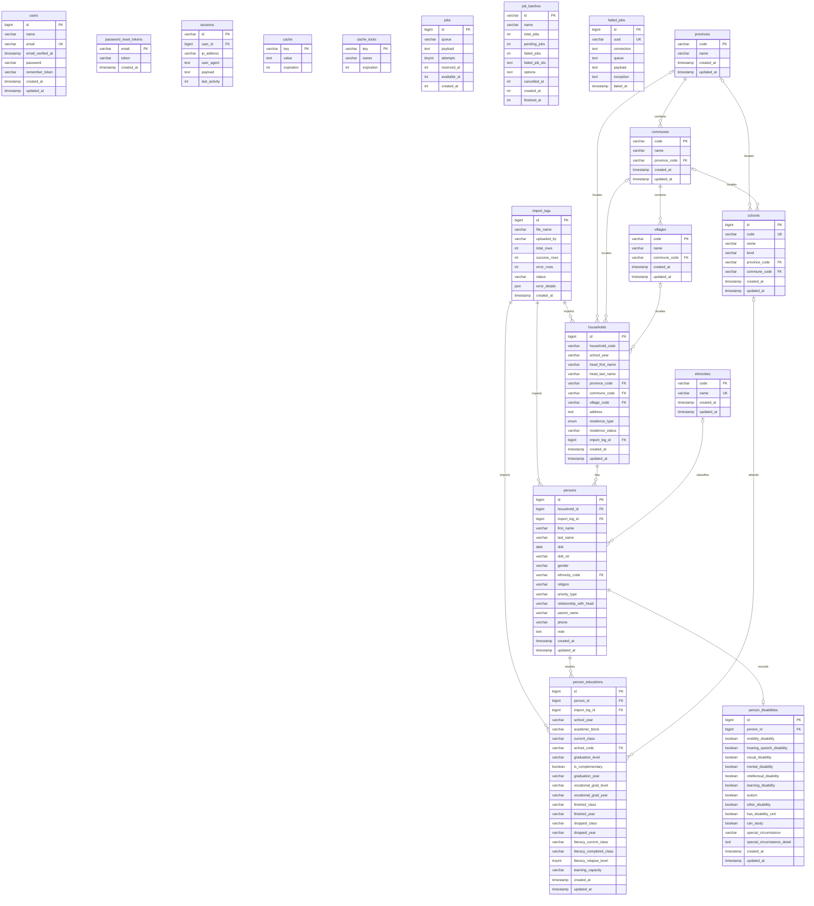

# PCGD Database ERD



## Database rules not visible as relationships

- `households` has a unique constraint on `(school_year, household_code)`.
- `person_educations` has a unique constraint on `(person_id, school_year)`.
- Database triggers `persons_one_head_before_insert` and `persons_one_head_before_update` enforce at most one person with `relationship_with_head = 'Chủ hộ'` per household.
- Deleting a household cascades to its persons; deleting a person cascades to education and disability records.
- `import_logs` are nullable parents for imported household, person, and education rows; deleting an import log sets those foreign keys to `NULL`.
- `sessions.user_id` is indexed but is not defined as a foreign key in the Laravel migration.

```

```
